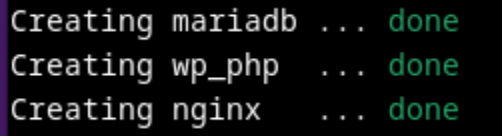

*This project has been created as part of the 42 curriculum by Fracurul*

# **Inception**


### DESCRIPTION

This project teaches you how to create your own docker container implementing certain services as database and WordPress.

#### *PROJECT DESCRIPTION*

The repository includes the project sources needed to build the infrastructure:

- a root `Makefile` to create the data directories, prepare the environment, and start or stop the stack;
- `srcs/docker-compose.yml` to define the services, networks, ports, and volumes;
- a `MariaDB image` with a custom configuration file and initialization script;
- a `WordPress image` with PHP-FPM setup and first-run application bootstrapping;
- an `Nginx image` configured as the HTTPS reverse proxy and entry point.

Docker is used to isolate each service, define explicit dependencies, and keep the deployment reproducible. The application is assembled from small, service-specific images instead of relying on prebuilt all-in-one containers.

#### *MAIN DESIGN CHOICES*

- MariaDB runs in its own container and stores its data on the host so the database survives container recreation.
- WordPress runs with PHP-FPM and is reached only through Nginx.
- Nginx terminates TLS and forwards PHP requests to the WordPress container.
- The services communicate through a dedicated Docker network instead of exposing internal ports to the host.
- Credentials and service settings are centralized in `srcs/.env` and copied to `/home/fracurul/.env` by the Makefile when the stack starts.

#### *REQUIRED COMPARISONS*

1. ***Virtual Machines vs Docker***

	Virtual Machines emulate an entire operating system, requiring more resources and longer startup times. Docker containers share the host OS kernel, making them lightweight, faster to start, and more efficient in resource usage. However, VMs provide stronger isolation since each has its own OS.

2. ***Secrets vs Environment Variables***

	Environment variables are simple key-value pairs passed to containers, but they can be exposed through logs or inspection. Docker Secrets store sensitive data encrypted and only mount it inside the container when needed, making them more secure for credentials like passwords or tokens.

3. ***Docker Network vs Host Network***

	With Docker Network, containers communicate through an isolated virtual network, providing better security and control. With Host Network, the container shares the host's network stack directly, which improves performance but removes network isolation.

4. ***Docker Volumes vs Bind Mounts***

	Docker Volumes are managed by Docker and stored in a dedicated area of the host filesystem, making them portable and easier to back up. Bind Mounts link a specific host directory directly to the container, giving more control but making the setup dependent on the host's directory structure.


### PREREQUISITES

Before running this project, make sure the following tools are installed on your system:

| Tool | Minimum version | Check |
|------|----------------|-------|
| Docker | 20.10+ | `docker --version` |
| Docker Compose | 2.0+ (or 1.29+ legacy) | `docker compose version` |
| Make | 4.0+ | `make --version` |
| OpenSSL | Any recent | `openssl version` |

> **Note:** This project was developed and tested on **Debian 11**. Some paths (e.g. `/home/fracurul/data/`) are system-specific and may need to be adjusted for other environments.


### PROJECT STRUCTURE

```
inception/
├── Makefile
└── srcs/
    ├── .env.example
    ├── docker-compose.yml
    └── requirements/
        ├── mariadb/
        │   ├── Dockerfile
        │   ├── conf/
        │   │   └── 50-server.cnf
        │   └── tools/
        │       └── init_db.sh
        ├── nginx/
        │   ├── Dockerfile
        │   └── conf/
        │       └── nginx.conf
        └── wordpress/
            ├── Dockerfile
            └── tools/
                └── wp-setup.sh
```

Data generated at runtime is stored outside the repository:

```
/home/fracurul/data/
├── mariadb/     ← MariaDB persistent storage (bind mount)
└── wordpress/   ← WordPress file storage (bind mount)
```


### CREDENTIALS / .env

The project requires an `.env` file with all credentials and configuration values. A template is provided at `srcs/.env.example`.

**Setup:**
```bash
cp srcs/.env.example srcs/.env
```

Then edit `srcs/.env` and fill in the following variables:

```
DB_NAME=          # database name
DB_USER=          # database user name
DB_USER_PASS=     # database user password
DB_ROOT_PASS=     # database root password
DOMAIN_NAME=      # your domain (e.g. fracurul.42.fr)
WP_USER=          # wordpress user name
WP_USER_PASS=     # wordpress user password
WP_ADMIN=         # wordpress admin name
WP_ADMIN_PASS=    # wordpress admin password
```
> ⚠️ **Never commit the `.env` file to your repository.** It is listed in `.gitignore` for this reason. Only commit `.env.example` with placeholder values.


### INSTRUCTIONS

1. Make sure all prerequisites are installed (see [PREREQUISITES](#prerequisites)).

2. Clone the repository and enter the project directory:
```bash
git clone <repo-url> inception && cd inception
```

3. Copy the environment template and fill in your credentials (see [CREDENTIALS](#credentials--env)):
```bash
cp srcs/.env.example srcs/.env
```

4. Compile and start the project:
```bash
make
```

At the end you should be able to see if any trouble has happened. Like this:



5. Available commands once the project is running:

- `make build` — create data directories and start the containers with docker-compose.
- `make down` — stop and remove the containers.
- `make re` — rebuild the entire project from scratch.
- `make fclean` — fully erase the project (containers, volumes, and local data directories).


### RESOURCES
- Docker documentation: https://docs.docker.com/
- Docker Compose documentation: https://docs.docker.com/compose/
- MariaDB documentation: https://mariadb.com/kb/en/documentation/
- WordPress documentation: https://wordpress.org/documentation/
- Nginx documentation: https://nginx.org/en/docs/
- PHP-FPM documentation: https://www.php.net/manual/en/install.fpm.php

#### *AI USAGE*
AI tools were used during the development of this project to better understand core concepts such as Docker networking, volume management, and service configuration. AI assisted in debugging Makefile rules, reviewing docker-compose syntax, and generating documentation. No AI was used to directly write functional code or configuration files.